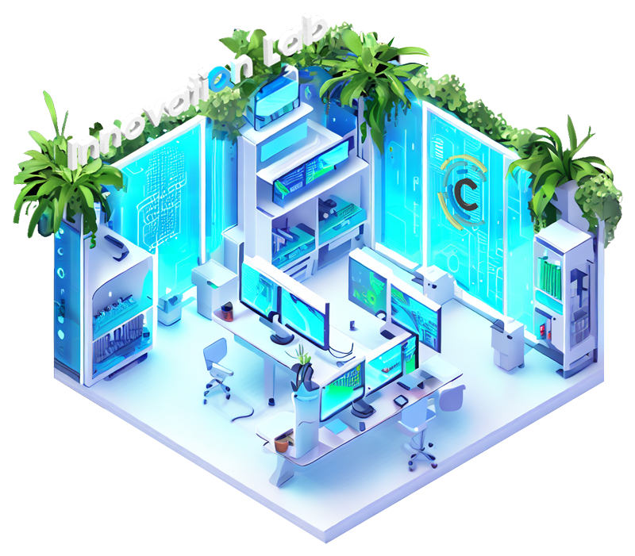

# Innovation Lab Extensions Lite

<picture></picture>

## Extensions

- [AL Language extension for Microsoft Dynamics 365 Business Central](https://marketplace.visualstudio.com/items?itemName=ms-dynamics-smb.al)
- [AL Variable Helper](https://marketplace.visualstudio.com/items?itemName=rasmus.al-var-helper)
- [AZ AL Dev Tools/AL Code Outline](https://marketplace.visualstudio.com/items?itemName=andrzejzwierzchowski.al-code-outline)
- [BusinessCentral.LinterCop](https://marketplace.visualstudio.com/items?itemName=StefanMaron.businesscentral-lintercop)
- [Create GUID](https://marketplace.visualstudio.com/items?itemName=nwallace.createGUID)
- [Docker](https://marketplace.visualstudio.com/items?itemName=ms-azuretools.vscode-docker)
- [Error Lens](https://marketplace.visualstudio.com/items?itemName=usernamehw.errorlens)
- [Format in context menus](https://marketplace.visualstudio.com/items?itemName=lacroixdavid1.vscode-format-context-menu)
- [Git Graph](https://marketplace.visualstudio.com/items?itemName=mhutchie.git-graph)
- [Todo Tree](https://marketplace.visualstudio.com/items?itemName=Gruntfuggly.todo-tree)
- [Trailing Spaces](https://marketplace.visualstudio.com/items?itemName=shardulm94.trailing-spaces)
- [waldo's CRS AL Language Extension](https://marketplace.visualstudio.com/items?itemName=waldo.crs-al-language-extension)
- [XLIFF Sync](https://marketplace.visualstudio.com/items?itemName=rvanbekkum.xliff-sync)
- [XML Tools](https://marketplace.visualstudio.com/items?itemName=DotJoshJohnson.xml)
